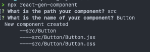

# react-gen-component

### [Github](https://github.com/vinceflores/react-gen-component) v1.0.0


A CLI tool to generate react components with ease.

# Installation

to install use

```
npm install react-gen-component
```

or to install it globally

```
npm install -g react-gen-component
```

# Usage

To run the script use;

```
npx react-gen-component
```

You should see something like



# Contributing

Contributions are welcome!
There are lots of possiblities to what scripts to be added. Here are some of them

- add boiler plate code for each <code> jsx </code> component
- generate specification using a config file
- generate reusable templates
